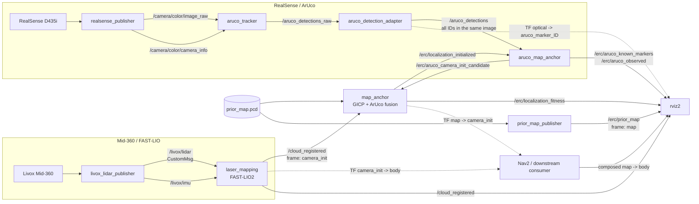
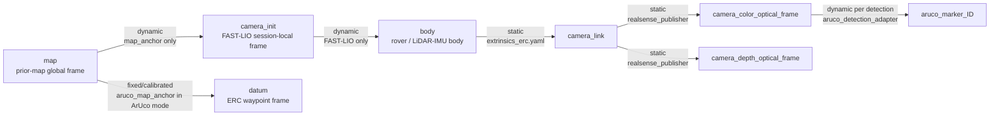
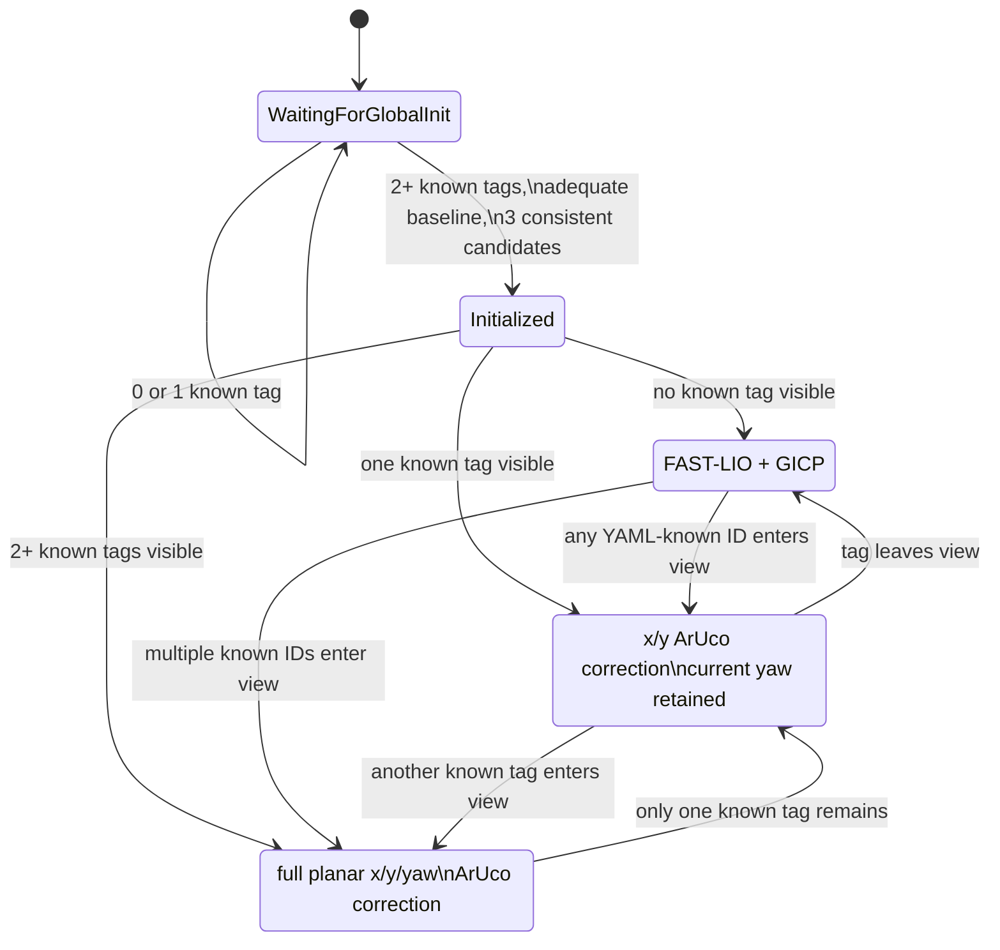
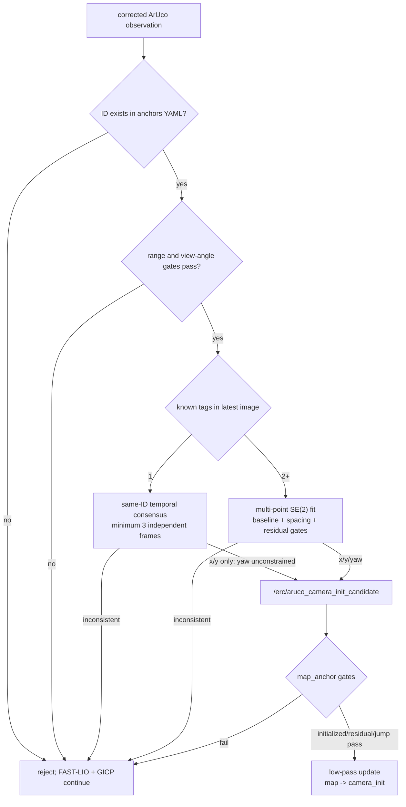

# ERC LiDAR–RealSense localization graph

This document describes the ROS 2 graph implemented for the ERC 2026 Traverse
localization experiments. It follows the code launched by:

```bash
ros2 launch ares_erc_bringup aruco_localize.launch.py \
  anchors_file:=<map-coordinate ArUco anchors.yaml> \
  global_init:=true
```

The design has one TF authority per edge. FAST-LIO supplies smooth local motion,
prior-map GICP supplies geometric global correction, and known ArUco landmarks supply
sparse absolute correction. GICP and ArUco are inputs to the same `map_anchor` node;
they do not publish competing `map -> camera_init` transforms.

## Runtime data flow



## TF tree and authority



The rover's global pose is the composed `map -> body` transform:

```text
T_map_body = T_map_camera_init * T_camera_init_body
```

`map -> camera_init` must not be interpreted as the rover pose. It aligns the current
FAST-LIO session frame with the saved prior map and can change as GICP or ArUco
corrections are fused.

## Landmark behavior while driving



After initialization, a known tag does **not** need to have been visible at startup.
History is stored independently by marker ID. If a previously unseen, YAML-known ID
enters the camera view while driving, three consistent same-ID camera frames enable its
translation-only correction. A simultaneous overlap with the old tag is not required.

A tag without a known map coordinate cannot provide an absolute correction on its first
observation. It may be registered as a new landmark for later loop closure, but its
initial stored coordinate inherits the localization error present at registration time;
that online-registration feature is not part of the current runtime.

## Main nodes and interfaces

| Node | Subscribes / input | Publishes / authority | Purpose |
|---|---|---|---|
| `livox_lidar_publisher` | Mid-360 Ethernet data | `/livox/lidar`, `/livox/imu` | Livox ROS driver |
| `laser_mapping` | `/livox/lidar`, `/livox/imu` | `/cloud_registered`, `/Odometry`, TF `camera_init -> body` | FAST-LIO local LiDAR-inertial motion |
| `realsense_publisher` | D435i USB streams | `/camera/color/image_raw`, `/camera/depth/image_raw`, `/camera/color/camera_info`, optical static TF | RGB/depth and calibrated camera information |
| `aruco_tracker` | color image and camera info | `/aruco_detections_raw` | OpenCV ArUco detection and PnP |
| `aruco_detection_adapter` | `/aruco_detections_raw` | `/aruco_detections`, TF `camera_color_optical_frame -> aruco_marker_<id>` | Correct detector frame convention and preserve all simultaneous IDs |
| `aruco_map_anchor` | `/aruco_detections`, TF, `/erc/localization_initialized`, anchor YAML | `/erc/aruco_camera_init_candidate`, `/erc/aruco_anchor_residual`, known/observed markers, TF `map -> datum` | Match known IDs to map coordinates and form gated correction candidates |
| `map_anchor` | `/cloud_registered`, prior-map PCD, `/erc/aruco_camera_init_candidate` | TF `map -> camera_init`, `/erc/localization_initialized`, `/erc/localization_fitness` | Single fusion/TF authority for GICP and ArUco corrections |
| `prior_map_publisher` | prior-map PCD | `/erc/prior_map` | Publish the saved map for RViz and diagnostics |
| `erc_waypoints` | waypoint YAML | `/erc/waypoint_markers`, `/erc/waypoint_poses` | Datum-frame mission waypoint output |
| `erc_odometry` | composed TF `map -> body` | `/erc/odometry`, `/erc/trajectory` | Optional Nav2-facing global odometry adapter |

## Correction and rejection path



Safety properties:

- One tag cannot initialize arbitrary global planar position and yaw.
- One tag after initialization corrects x/y only; it cannot overwrite yaw.
- Two or more tags must come from the exact same camera image.
- Pairwise 3-D tag spacing is checked before fitting, catching wrong YAML coordinates
  or marker scale independently of rover pose.
- Exact capture-time TF is used; using the latest TF while moving would introduce a
  velocity-times-latency bias.
- GICP fitness, ArUco residual, correction jump, range, viewing angle, baseline, and
  temporal-consistency gates reject unsafe corrections.

## Useful diagnostics

```bash
# Global initialization state
ros2 topic echo /erc/localization_initialized --once

# Prior-map registration quality; lower is better
ros2 topic echo /erc/localization_fitness

# Every marker detected in one camera frame
ros2 topic echo /aruco_detections --once

# Actual global rover pose and localization-frame correction
ros2 run tf2_ros tf2_echo map body
ros2 run tf2_ros tf2_echo map camera_init

# Confirm one-tag and multi-tag correction candidates
ros2 topic echo /erc/aruco_camera_init_candidate

# Verify that each TF edge has a single publisher
ros2 run tf2_tools view_frames
```

## Configuration files

- `config/mid360_mapping.yaml`: FAST-LIO Mid-360/IMU configuration.
- `config/MID360_config_erc.json`: Livox driver configuration without the conflicting
  driver-side 180-degree extrinsic.
- `config/localization.yaml`: GICP and candidate-fusion gates.
- `config/extrinsics_erc.yaml`: rigid `body -> camera_link` transform. The current
  zero placeholder must be replaced by a formal RealSense–Mid-360 calibration.
- `config/aruco_anchors_erc.yaml`: ERC landmark IDs, map/datum coordinates, and gates.
- `config/aruco_anchors_indoor_calibrated.yaml`: indoor test-only measured anchors.
- `maps/prior_map.pcd`: generated prior map. PCD files are intentionally excluded from
  Git because they are large environment-specific artifacts.

## Current validation status

Indoor hardware testing has confirmed:

- simultaneous ID 51/52 detection and multi-marker global initialization;
- global initialization remains false while the camera is covered;
- reacquisition initializes after consistent known-marker observations;
- post-initialization one-tag x/y correction while preserving yaw;
- automatic transition between two-tag and one-tag correction;
- approximately 0.37 m combined translation/rotation with one tag while the red live
  cloud remained visually aligned to the grey prior map;
- fitness remained below the configured `0.08` acceptance threshold.

Still required before ERC deployment:

- formal RealSense–Mid-360 rigid extrinsic calibration;
- a never-seen-at-start tag handover test (`ID51 -> none -> ID53`);
- longer loops with terrain, larger yaw changes, tag occlusion, and changing IDs;
- replacement of indoor anchors and zero extrinsics with the final Mars Yard survey.
