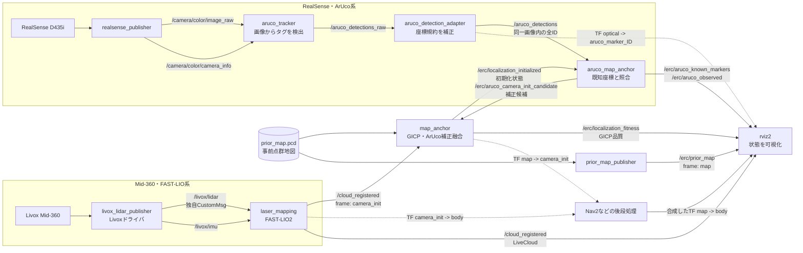
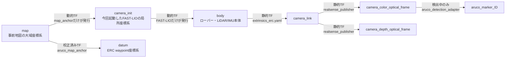
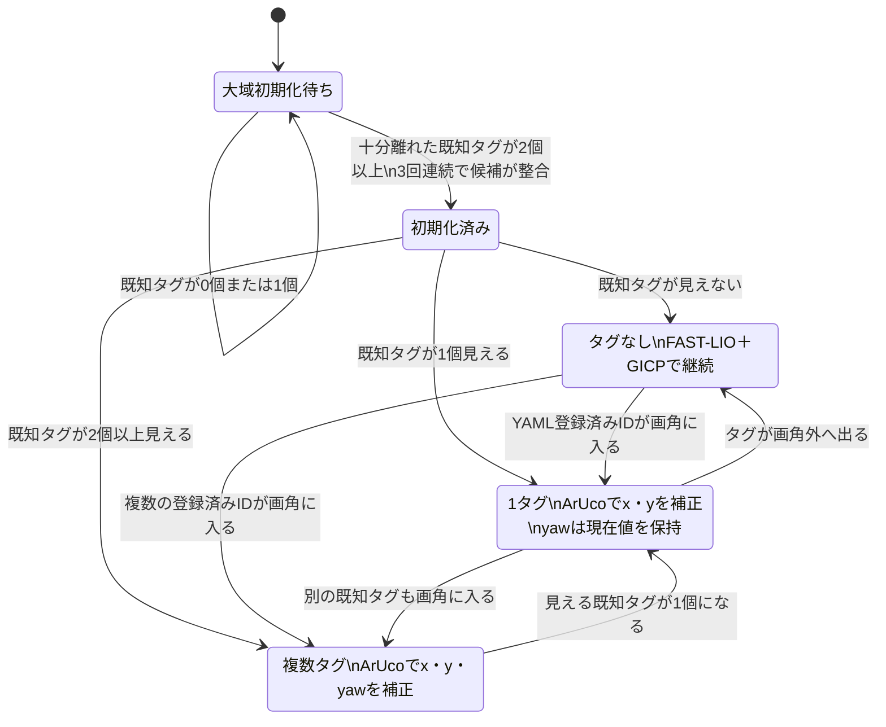
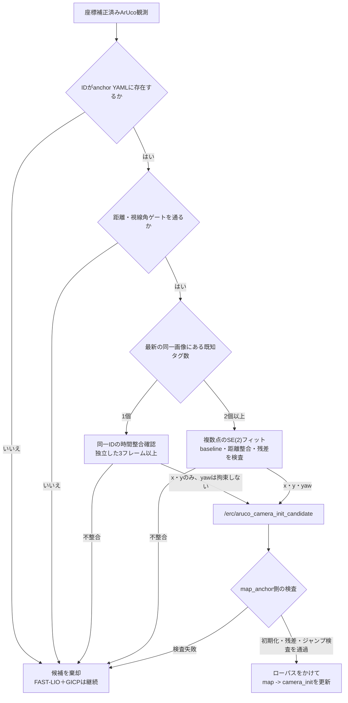

# ERC LiDAR–RealSense 自己位置推定システム

この文書は、ERC 2026 Navigation: Traverse に向けて実装した
`ares_erc_bringup` の自己位置推定系について、パッケージの役割、ノード間通信、
TF構成、ArUcoランドマークによる補正方法、実験状況をまとめたものです。

実装の中心となる起動コマンドは次のとおりです。

```bash
ros2 launch ares_erc_bringup aruco_localize.launch.py \
  anchors_file:=<地図座標系で記述したArUco座標.yaml> \
  global_init:=true
```

## 1. このシステムの目的

ERC会場ではGNSSを使わず、事前に作成した点群地図上でローバーの位置と姿勢を
継続的に求める必要があります。そこで本システムでは、性質の異なる次の3情報を
組み合わせています。

1. **FAST-LIO**
   - Mid-360の点群とIMUから、滑らかで高周期な局所移動を推定します。
   - 短時間の相対移動には強い一方、長距離走行では誤差が蓄積します。
2. **事前点群地図とのGICP**
   - 現在のLiveCloudを保存済みのPriorMapへ位置合わせします。
   - 壁や地形などの幾何形状から、大域的なずれを補正します。
3. **既知座標のArUcoランドマーク**
   - タグIDと地図上の座標を対応付け、疎な絶対位置情報として利用します。
   - 点群照合が退化しやすい地形でも、タグを再発見したときに補正できます。

重要なのは、GICPとArUcoが別々にTFを発行しないことです。両者は
`map_anchor` に補正候補を入力し、`map_anchor`だけが
`map -> camera_init` を発行します。これによりTFの二重発行や、補正同士の
競合を防いでいます。

## 2. `ares_erc_bringup` パッケージの役割

`ares_erc_bringup` は、ERC向けの自己位置推定機能をまとめるROS 2パッケージです。
FAST-LIOやLivoxドライバ、RealSenseドライバ、ArUco検出器そのものを再実装する
パッケージではありません。それぞれの既存パッケージを起動し、ERC用の設定と
次の追加処理を提供します。

- Mid-360とFAST-LIOをERC用パラメータで起動する
- FAST-LIOのLiveCloudを事前点群地図へGICPで位置合わせする
- RealSense画像から得た複数ArUco検出を、IDごとに失わず受け渡す
- ArUco検出器の座標規約を補正し、タグ表面の正しいTFを作る
- 既知タグ座標と観測座標を比較して、自己位置補正候補を生成する
- GICP補正とArUco補正を1つの`map -> camera_init`へ融合する
- 既知タグ・観測タグ・PriorMap・LiveCloudをRVizに表示する
- 後段のNav2が利用できる`map -> body`および`/erc/odometry`の基礎を提供する

パッケージの境界は次のとおりです。

| 区分 | 担当 |
|---|---|
| Mid-360データ取得 | `livox_ros_driver2` |
| LiDAR–IMU局所推定 | `fast_lio` |
| RGB・Depth・CameraInfo配信 | `realsense_from_lib` |
| ArUco画像検出 | `aruco_opencv` |
| ERC用座標補正・ランドマーク照合・GICP融合 | **`ares_erc_bringup`** |
| 経路計画・障害物回避・車体制御 | 将来接続するNav2および制御パッケージ |

## 3. 用途別のlaunchファイル

| launchファイル | 用途 | 主なセンサ |
|---|---|---|
| `mapping_mid360.launch.py` | 事前点群地図を作成する | Mid-360 |
| `localize.launch.py` | FAST-LIO＋GICPで事前地図上に定位する | Mid-360 |
| `aruco_localize.launch.py` | GICPにArUco初期化・走行中補正を追加する本命構成 | Mid-360＋RealSense |
| `aruco_calibrate.launch.py` | 既知タグを事前地図座標系で測定する | Mid-360＋RealSense |
| `aruco_global_init_demo.launch.py` | ハードウェアなしで大域初期化を確認する | 不要 |
| `aruco_anchor_demo.launch.py` | ハードウェアなしでタグ補正を可視化する | 不要 |
| `odometry.launch.py` | `map -> body`をOdometryと軌跡として出力する | Mid-360 |

`localize.launch.py` は、開始姿勢が事前地図作成時の姿勢に概ね近い場合の
LiDAR中心の構成です。任意の開始位置からArUcoで大域初期化したい場合や、
走行中に既知タグをランドマークとして使いたい場合は
`aruco_localize.launch.py`を使用します。

## 4. 実行時のノード・topic構成

図中の実線はtopic通信、破線はTFの発行または参照を示します。



## 5. TFツリーと発行責任

ROS 2では同じTFを複数ノードが発行すると、位置が飛ぶ、点群が揺れる、
Nav2の座標変換が不安定になるといった問題が起きます。本システムではTFごとに
発行ノードを1つに固定しています。



ローバーの大域姿勢は、次の合成TFです。

```text
T_map_body = T_map_camera_init * T_camera_init_body
```

したがって、実際のローバー位置を確認するときは`map -> body`を使います。
`map -> camera_init`はローバーの姿勢そのものではなく、今回のFAST-LIO起動時に
作られた局所座標系を事前地図へ合わせるための変換です。GICPやArUco補正により
走行中に更新される可能性があります。

## 6. 各座標系の意味

| 座標系 | 意味 |
|---|---|
| `map` | 保存済みPriorMapの座標系。自己位置推定の大域基準 |
| `camera_init` | FAST-LIOが起動ごとに作る局所世界座標系 |
| `body` | FAST-LIOが推定するローバー本体座標系 |
| `camera_link` | RealSense本体座標系 |
| `camera_color_optical_frame` | OpenCV画像処理で使用する光学座標系 |
| `aruco_marker_<id>` | 検出した各タグ中心の座標系 |
| `datum` | ERCから与えられるwaypointの座標系 |

タグ座標YAMLの`coordinate_frame: map`は、タグ中心座標がPriorMap内で直接測定
されていることを表します。本番で`datum`座標を使用する場合は、配布される座標
規約に合わせて`map -> datum`を校正する必要があります。

## 7. 走行中に見えるタグ数と補正内容



### 7.1 起動時の大域初期化

任意の開始位置から`global_init:=true`で起動する場合、1個の点だけでは平面上の
並進とyawを同時に一意に決められないため、2個以上の既知タグを使用します。
2タグの間隔、既知座標と観測座標の距離整合性、候補の時間的整合性を確認し、
3回連続で信頼できる候補が得られた後に
`/erc/localization_initialized`が`true`になります。

### 7.2 初期化後に既知タグが1個だけ見える場合

初期化後は、既知タグ1個から`map -> camera_init`のx・y補正候補を作ります。
単一タグの観測からyawを上書きすると、遠距離・斜め観測・平面PnPの曖昧性により
姿勢が飛ぶ危険があるため、yawはFAST-LIO/GICPの現在値を保持します。

同じIDを独立した3画像以上で検出し、候補位置のばらつきが設定値以内の場合だけ
補正候補を発行します。同じ画像を更新周期の違いによって複数回数えることは
ありません。

### 7.3 走行中に初めて画角へ入ったタグ

起動時に見えていたかどうかは関係ありません。YAMLにIDと地図座標が登録済み
であれば、走行中に初めて見えたタグでも補正に使用できます。履歴はIDごとに
分離されているため、例えば次のような切り替わりを想定しています。

```text
ID51とID52で初期化
  -> ID51のみ
  -> タグなし
  -> 起動時には見えていなかったID53のみ
  -> ID53とID54
```

古いタグと新しいタグが同時に見える必要はありません。ただし、新しいIDの
3フレーム整合確認が終わるまではFAST-LIO＋GICPだけで走行を継続します。

### 7.4 地図座標が未知のタグ

YAMLに地図座標がないタグは、初めて見た時点では絶対位置補正に使用できません。
現在の自己位置を基準にタグ座標を登録することはできますが、その座標には登録時
の自己位置誤差も含まれます。そのため「初回観測した未知タグで、その初回観測の
自己位置を補正する」ことはできません。

未知タグのオンライン登録と再訪時のループ閉じ込みは、現在の実装範囲には
含まれていません。

## 8. 主なノードとインターフェース

| ノード | 入力 | 出力・TF権限 | 役割 |
|---|---|---|---|
| `livox_lidar_publisher` | Mid-360のEthernetデータ | `/livox/lidar`, `/livox/imu` | Livox ROSドライバ |
| `laser_mapping` | `/livox/lidar`, `/livox/imu` | `/cloud_registered`, `/Odometry`, TF `camera_init -> body` | FAST-LIOによる局所LiDAR–IMU推定 |
| `realsense_publisher` | D435iのUSBストリーム | RGB, Depth, CameraInfo, optical静的TF | RealSenseデータ配信 |
| `aruco_tracker` | カラー画像、CameraInfo | `/aruco_detections_raw` | OpenCVによるタグ検出とPnP |
| `aruco_detection_adapter` | `/aruco_detections_raw` | `/aruco_detections`, TF `optical -> aruco_marker_<id>` | 座標規約を補正し、同時検出した全IDを保持 |
| `aruco_map_anchor` | `/aruco_detections`, TF, 初期化状態, anchor YAML | 補正候補、残差、既知・観測マーカー、TF `map -> datum` | IDと既知座標を照合し、補正候補を生成 |
| `map_anchor` | LiveCloud、PriorMap、ArUco補正候補 | TF `map -> camera_init`, 初期化状態, fitness | GICPとArUcoを融合する唯一のTF発行元 |
| `prior_map_publisher` | PriorMap PCD | `/erc/prior_map` | RViz診断用に事前地図を配信 |
| `erc_waypoints` | waypoint YAML | waypointマーカー・PoseArray | ERC waypointを`datum`座標系で配信 |
| `erc_odometry` | 合成TF `map -> body` | `/erc/odometry`, `/erc/trajectory` | Nav2向けOdometryと軌跡を生成 |

## 9. 主要topic一覧

| topic | 型 | 発行元 | 主な利用先・意味 |
|---|---|---|---|
| `/livox/lidar` | `livox_ros_driver2/msg/CustomMsg` | Livoxドライバ | FAST-LIO入力点群 |
| `/livox/imu` | `sensor_msgs/msg/Imu` | Livoxドライバ | FAST-LIO入力IMU |
| `/cloud_registered` | `sensor_msgs/msg/PointCloud2` | FAST-LIO | `camera_init`座標系のLiveCloud |
| `/camera/color/image_raw` | `sensor_msgs/msg/Image` | RealSense | ArUco検出入力 |
| `/camera/depth/image_raw` | `sensor_msgs/msg/Image` | RealSense | Depth画像。現在のArUco補正では直接未使用 |
| `/camera/color/camera_info` | `sensor_msgs/msg/CameraInfo` | RealSense | ArUco PnP用内部パラメータ |
| `/aruco_detections_raw` | `aruco_opencv_msgs/msg/ArucoDetection` | ArUco検出器 | 補正前の検出結果 |
| `/aruco_detections` | `aruco_opencv_msgs/msg/ArucoDetection` | adapter | 補正済み・同一画像内の全タグ |
| `/erc/aruco_camera_init_candidate` | `geometry_msgs/msg/PoseWithCovarianceStamped` | ArUco anchor | `map -> camera_init`補正候補 |
| `/erc/localization_initialized` | `std_msgs/msg/Bool` | `map_anchor` | 大域初期化完了状態。transient-local |
| `/erc/localization_fitness` | `std_msgs/msg/Float32` | `map_anchor` | GICP品質。小さいほど良い |
| `/erc/prior_map` | `sensor_msgs/msg/PointCloud2` | PriorMap publisher | RVizの灰色事前地図 |
| `/erc/aruco_known_markers` | `visualization_msgs/msg/MarkerArray` | ArUco anchor | YAML登録済みタグの黄色表示 |
| `/erc/aruco_observed` | `visualization_msgs/msg/MarkerArray` | ArUco anchor | 観測タグの青色表示 |
| `/erc/odometry` | `nav_msgs/msg/Odometry` | `erc_odometry` | Nav2へ渡す候補となる大域Odometry |

## 10. ArUco補正の検査・棄却経路



主な安全設計は次のとおりです。

- 1タグだけでは任意開始時の大域初期化を行わない
- 初期化後の1タグ補正はx・yだけとし、yawを上書きしない
- 複数タグフィットには、同じカメラ画像に写ったタグだけを使用する
- タグ間の既知3次元距離と観測距離を、姿勢計算前に比較する
- 画像取得時刻のTFを使用し、移動中に「最新TF」で代用しない
- GICP fitness、ArUco残差、補正ジャンプ、距離、視線角、タグ間隔、
  時間整合性のいずれかが悪い候補を棄却する
- 候補を棄却してもFAST-LIO＋GICPの局所推定は停止しない

## 11. 設定ファイルの役割

| ファイル | 内容 |
|---|---|
| `config/mid360_mapping.yaml` | FAST-LIOのMid-360・IMU設定 |
| `config/MID360_config_erc.json` | Livoxドライバ設定。競合するドライバ側180°外部変換を除去 |
| `config/localization.yaml` | GICP、初期化、補正融合、棄却ゲート |
| `config/extrinsics_erc.yaml` | 静的TF `body -> camera_link` |
| `config/aruco_anchors_erc.yaml` | ERC本番用タグID・座標・ゲート |
| `config/aruco_anchors_indoor_calibrated.yaml` | 屋内実験専用の校正済みタグ座標 |
| `config/waypoints_erc.yaml` | ERC waypointと`datum`設定 |
| `maps/prior_map.pcd` | GICPの照合先となる事前点群地図 |

`prior_map.pcd`は環境ごとに作成するデータで、Gitには含めていません。新しい環境
では`mapping_mid360.launch.py`でスキャンし、`downsample_map`でダウンサンプリング
して配置します。詳細は`ares_erc_bringup/maps/README.md`を参照してください。

`extrinsics_erc.yaml`の現在値は正式校正前の仮値です。RealSenseとMid-360の
取付誤差は、タグまでの距離が伸びるほど大域位置誤差へ影響するため、本番前に
外部パラメータ校正が必要です。

## 12. RViz表示の読み方

`erc_aruco.rviz`では主に次の表示を使用します。

| 表示 | 意味 | 正常時の見方 |
|---|---|---|
| `PriorMap` | 灰色の事前点群地図 | 固定されている |
| `LiveCloud` | 赤色の現在点群 | 灰色の床・壁・地形と重なる |
| `ArucoKnown` | 黄色の既知タグ | YAMLに登録した地図上の位置 |
| `ArucoObserved` | 青色の観測タグ | 正常定位時は対応する黄色タグ付近に重なる |
| `TF` | 座標軸 | TFの向きや二重発行を確認する |
| `CameraColor` | RealSenseカラー画像 | 実際に画角へ入っているタグを確認する |

点群が重なっていることだけでなく、`/erc/localization_fitness`、タグ残差、
`map -> body`の連続性も合わせて確認します。形状が対称的な場所では、見た目上
重なっていても誤った局所解に入る可能性があるためです。

## 13. 診断コマンド

```bash
# 大域初期化状態
ros2 topic echo /erc/localization_initialized --once

# GICP品質。小さいほど良い
ros2 topic echo /erc/localization_fitness

# 1画像内で検出された全タグ
ros2 topic echo /aruco_detections --once

# 実際の大域ローバー姿勢
ros2 run tf2_ros tf2_echo map body

# FAST-LIO局所座標系に対する補正
ros2 run tf2_ros tf2_echo map camera_init

# 1タグ・複数タグの補正候補
ros2 topic echo /erc/aruco_camera_init_candidate

# TFツリーと各TF発行元
ros2 run tf2_tools view_frames

# 主なtopicの接続とQoS
ros2 topic info -v /cloud_registered
ros2 topic info -v /aruco_detections
```

## 14. これまでの実機検証

屋内環境で次を確認済みです。

- ID51とID52を同じ画像で安定して同時検出できる
- 2タグから複数の大域初期化候補を作り、初期化を完了できる
- カメラを目隠しした状態では、誤って大域初期化しない
- タグを再表示すると、時間整合確認後に初期化できる
- 初期化後は1タグだけでもx・y補正を継続し、yawを保持する
- 2タグ補正と1タグ補正を自動的に切り替えられる
- 約0.37 mの移動と姿勢変化を含む1タグ試験中も、赤色LiveCloudと
  灰色PriorMapが目視上重なり続けた
- 同試験のGICP fitnessは設定上限`0.08`未満だった
- 1タグ候補の補正ジャンプ棄却・残差超過棄却は発生しなかった

これらは屋内のID51・ID52と屋内用PriorMapを使った結果です。ERC会場での性能を
保証するものではありません。

## 15. 現在の制約と次の検証

本番投入前に、少なくとも次が必要です。

1. **RealSense–Mid-360外部パラメータ校正**
   - `body -> camera_link`の並進・回転を正式に測定します。
2. **起動時に見えていないタグへの引き継ぎ試験**
   - `ID51/52で初期化 -> タグなし -> 初めてID53を検出`を検証します。
3. **長距離・大yaw・起伏を含むループ走行**
   - FAST-LIOドリフト、GICP再捕捉、タグの遮蔽と再発見を確認します。
4. **複数のタグIDが刻々と変わる試験**
   - 1タグ、0タグ、別の1タグ、複数タグという実運用に近い遷移を確認します。
5. **ERC本番データへの差し替え**
   - 最終的なタグID・座標・辞書、waypoint、PriorMapへ置き換えます。
6. **Nav2との正式接続**
   - `/erc/odometry`、ローバー外形、運動学、速度制限、costmapを統合します。

## 16. 関連文書

- `ares_erc_bringup/README.md`
  - 地図作成、定位、ArUco校正、起動コマンドの詳細
- `ares_erc_bringup/maps/README.md`
  - PCDの保存場所と新しい環境での地図作成方法
- `doc/erc_localization_handoff.md`
  - Nav2担当者へ渡すインターフェースとパッケージ境界
- `doc/erc_new_environment_runbook.md`
  - 新環境でのスキャンから定位までの運用手順
- `doc/erc_phase0_progress.md`
  - Mid-360・FAST-LIO地図作成段階の記録
- `doc/erc_phase1_progress.md`
  - PriorMapへのGICP定位実装と初期検証
- `doc/node_topic_graph_README.md`
  - 既存のURC/Nav2系を含むワークスペース全体の通信グラフ
