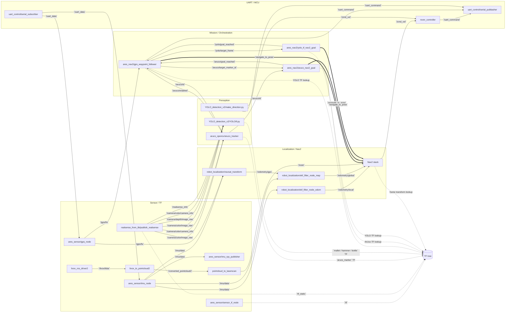
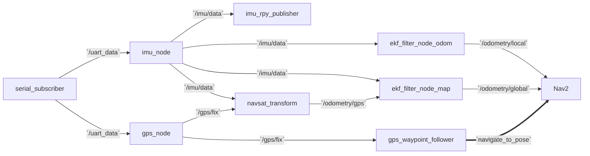
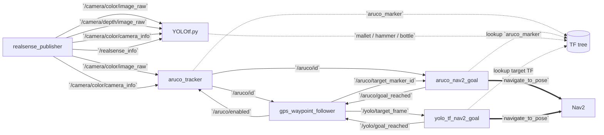
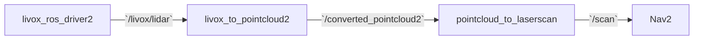
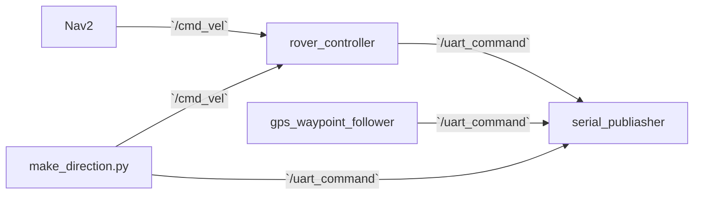

# ノード・トピック通信グラフ

このドキュメントは、現在のコードと launch 構成をもとに、「どのノードがどのトピックや TF を介してつながっているか」を俯瞰できるようにしたものです。  
特に、以下の 3 つを重ねて運用する前提で読むと全体像をつかみやすくなります。

- `ares_nav2/launch/controller_bringup.launch.py`
- `ares_nav2/launch/navigation_sim.launch.py`
- `ares_nav2/launch/main.launch.py`

## 読み方

- 実線矢印: topic による publish / subscribe
- 破線矢印: TF の publish / lookup
- 太線矢印: Nav2 の `navigate_to_pose` action

## 全体グラフ

## 系統ごとの見方

### 1. UART から自己位置推定まで

- `uart_control/serial_subscriber` が UART の `ID,DATA` 行を `Float64MultiArray` の `/uart_data` に変換します。
- `ares_sensor/imu_node` は `/uart_data` から IMU 成分を抜き出して `/imu/data` を publish します。
- `ares_sensor/gps_node` は `/uart_data` から緯度経度を抜き出して `/gps/fix` を publish します。
- `robot_localization` 側では `/gps/fix` と IMU を使って `odometry/gps` と各 EKF の推定結果を作り、Nav2 が利用します。
- 同じ `/gps/fix` は `gps_waypoint_follower` にも入り、waypoint を ENU 座標へ変換する基準として使われます。

### 2. ArUco と YOLO の認識から接近制御まで

- `aruco_tracker` は画像入力を受けつつ、`/aruco/enabled` が `true` のときだけ検出を進めます。
- ArUco で見えた ID は `/aruco/id` に流れ、同時に `aruco_marker` TF が出ます。
- `gps_waypoint_follower` は waypoint ごとに必要なマーカー ID を `/aruco/target_marker_id` へ出し、`aruco_nav2_goal` がその ID と TF の両方を見て Nav2 ゴールへ変換します。
- YOLO 経路は `/yolo/target_frame` で追跡対象を切り替え、`yolo_tf_nav2_goal` が対応する TF を Nav2 ゴールへ変換します。

### 3. LiDAR から Nav2 の障害物回避まで

- `livox_ros_driver2` の出力は独自メッセージです。
- `livox_to_pointcloud2` が `PointCloud2` に変換し、`pointcloud_to_laserscan` が `/scan` に落とします。
- `ares_nav2/config/nav2_no_map_params.yaml` では Nav2 の obstacle layer が `/scan` を読みに行きます。

### 4. 最後に MCU へ送る制御系

- 通常の移動では Nav2 が `/cmd_vel` を出し、`rover_controller` が `uart_command` に変換します。
- waypoint 到達時には `gps_waypoint_follower` 自身が停止系コマンドを `uart_command` に直接送ります。
- `YOLO_detection_v2/make_direction.py` は別ルートで `/cmd_vel` と `uart_command` を直接出せるため、Nav2 ベースの制御とは別の簡易追従経路として読むと分かりやすいです。

## 主要 topic / TF 一覧

| 名前 | Publisher | Subscriber / 利用者 | 用途 |
| --- | --- | --- | --- |
| `/uart_data` | `serial_subscriber` | `imu_node`, `gps_node` | UART 生データの ROS 化 |
| `/imu/data` | `imu_node` | `imu_rpy_publisher`, `robot_localization` | IMU 本体データ |
| `/gps/fix` | `gps_node` | `navsat_transform`, `gps_waypoint_follower` | GPS 緯度経度 |
| `/camera/color/image_raw` | `realsense_publisher` | `aruco_tracker`, `YOLOtf.py` | 認識用カラー画像 |
| `/camera/depth/image_raw` | `realsense_publisher` | `YOLOtf.py` | 対象距離の算出 |
| `/camera/color/camera_info` | `realsense_publisher` | `aruco_tracker`, `YOLOtf.py` | カメラ内部パラメータ |
| `/realsense_info` | `realsense_publisher` | `YOLOtf.py` | depth scale と焦点距離 |
| `/aruco/id` | `aruco_tracker` | `gps_waypoint_follower`, `aruco_nav2_goal`, RViz | 検出中マーカー ID |
| `aruco_marker` | `aruco_tracker` | `aruco_nav2_goal` | ArUco の相対位置 TF |
| `/livox/lidar` | `livox_ros_driver2` | `livox_to_pointcloud2` | Livox 独自点群 |
| `/converted_pointcloud2` | `livox_to_pointcloud2` | `pointcloud_to_laserscan` | 標準 `PointCloud2` |
| `/scan` | `pointcloud_to_laserscan` | Nav2 | 障害物回避用 LaserScan |
| `/aruco/enabled` | `gps_waypoint_follower` | `aruco_tracker` | ArUco 処理の有効化 |
| `/aruco/target_marker_id` | `gps_waypoint_follower` | `aruco_nav2_goal` | 追うべきマーカー ID |
| `/aruco/goal_reached` | `aruco_nav2_goal` | `gps_waypoint_follower` | ArUco 接近完了通知 |
| `/yolo/target_frame` | `gps_waypoint_follower` | `yolo_tf_nav2_goal` | 追跡対象 TF 名 |
| `/yolo/goal_reached` | `yolo_tf_nav2_goal` | `gps_waypoint_follower` | YOLO 接近完了通知 |
| `/cmd_vel` | Nav2, `make_direction.py` | `rover_controller` | ローバー速度指令 |
| `/uart_command` | `rover_controller`, `gps_waypoint_follower`, `make_direction.py` | `serial_publiasher` | MCU に送る最終コマンド |

## 読むときの注意

- この図は「現状コードから読み取れる接続」を優先しており、実験用ノードやログ専用ノードは省略しています。
- `sensor_tf_node` は `map -> odom` と `base_link` 配下の各フレームを publish します。`odom -> base_link` は `robot_localization` 側に任せる前提の構成です。
- YOLO 系には 2 系統あります。
  - `YOLOtf.py`: TF を出して `yolo_tf_nav2_goal` と連携する経路
  - `make_direction.py`: 画像から直接 `/cmd_vel` / `uart_command` を出す簡易追従経路
- `main.launch.py` には `YOLOtf.py` 自体は含まれていません。YOLO TF ベースの接近を使う場合は、TF を出す側のノードを別途起動する必要があります。
- `dual_ekf_navsat.launch.py` の `navsat_transform_node` には IMU の remap が入っており、実運用時には `imu` と `imu/data` の接続名を一度確認したほうが安全です。
- `make_direction.py` は `camera/camera/color/image_raw` を購読するため、`realsense_from_lib` の既定トピック `camera/color/image_raw` とそのままでは一致しません。
